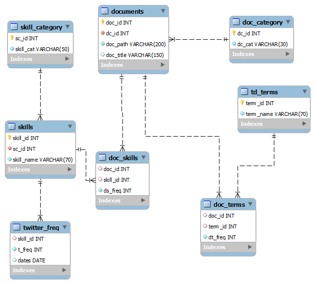

```{r, echo = FALSE, message=FALSE, warning=FALSE}
library(knitr)
```

__---------------------------------------------------------------------------------------------------------------------------------------------------------------------------------------__

# Introduction

For this project we are asked to use data to answer the question: __"Which are the most valued data science skills?"__  The term "Most Valued" can be interpreted in a variety of manners. For example, it could be used to indicate which skills are most in demand, which skills are most highly compensated (which is not necessarily the same as being "most in demand"), or even which behavioral traits are most desirable in the personality and work ethic of the practitioner. Therefore, how we go about answering that question can be a highly subjective undertaking.

In an attempt to limit the subjectiveness of our own approach to answering that question, we've elected to examine both web-based and social media content for purposes of identifying the most commonly referenced data science skills. The frequency with which a particular skill is mentioned in new articles, social media postings, and other sources of web-based information can potentially serve as a proxy for identifying the "most valuable" data science skills.

Specifically, we make use of a variety of R-based data collection tools to analyze the contents of relevant web pages and Twitter comments. Data science skill names are identified within those sources of data with frequency counts tallied for each skill name within a given source "document" or, in the case of Twitter, the source data cache. The frequency data is then used as the basis of our data analysis to identify what we believe are the most frequently mentioned, and hence "most valuable", data science skills.

__---------------------------------------------------------------------------------------------------------------------------------------------------------------------------------------__

## Team Members

Our team is comprised of the following members (*in alphabetical order, L->R, by surname*):

| Team Members       | 
| ------------------ | ------------------ | ------------------ |
| Christopher Martin | Asher Meyers       |  Kishore Prasad    | 
| Rob Sellers        | Gupreet Singh      |  Dan Smilowitz     | 
| Logan Thomson      | James Topor        |  Chirag Vithalani  | 

__---------------------------------------------------------------------------------------------------------------------------------------------------------------------------------------__

# Our Approach

Three separate data collection strategies have been employed, each of which relies upon a distinct methodology to arrive at a frequency count for the mention of data science skill names within either URL or Twitter feed data. Each of these methodologies is summarized briefly here and explained in greater detail in the section titled __'Data Collection'__.

## Method 1: URL Data - Applying a "Best Guess" Approach

The first data collection method is built upon the idea that we, as data scientists, should have at least some idea of what the most valuable data science skills might be. To that end, a pre-compiled list of skills is read by an algorithm that searches for all mentions of each skill within each URL of a pre-compiled list of web pages. Frequency counts are tallied for each search term within each document and stored within an R data frame. The results of that process are then loaded into a method-specific set of fully normalized MySQL tables.  

## Method 2: URL Data - Creating a Term-Document Matrix

The second method makes use of an algorithm presented in Chapter 10 of the textbook "__Automated Data Collection with R__", written by Simon Munzert, Christian Rubba, Peter Meissner, and Dominic Nyhuis. They present the concept of a 'term-document' matrix, wherein a text analysis algorithm is applied to a set of documents (or URL's) to tally up the frequencies of the most commonly occurring terms/phrases both within each document and across the entire set of documents. The result of their algorithm is a two-dimensional matrix where one axis represents the terms/phrases found by the algorithm and the other axis represents the names of the source documents. The contents of the cells within the matrix are the frequency counts for each term/phrase and document pair.

The results of that process are transformed into an R data frame and subsequently loaded into a set of method-specific normalized MySQL tables.

## Method 3: Twitter Data 

The third method makes use of a feature of the Twitter messaging service that allows its users to extract a collection of Twitter feed data generated on a specific date. The data are housed within a cache that the Twitter service relies upon for part of its functionality. The cache data is downloaded into CSV files for several days , one file for each date. The pre-built list of data science skills mentioned with Method 1 above is then applied against the contents of the CSV files with frequency counts for each skill name being tallied. The resulting R data frame is then loaded into a method-specific normalized MySQL tables.

## What Happens After Data Collection?

The contents of the MySQL tables are then used for purposes of data analysis. Pre-built SQL procedures fetch the relevant data from the database in a tidy format for direct loading into R data frames. The data frames are then used for the data analysis discussed herein.

## Tools Used

Our team made use of __Slack__ to facilitate ongoing project discussions. We also linked our Slack team to a shared __Github__ repository for file sharing and version control purposes. A nice feature of Slack is that you can easily review all of the activity within the shared Github repository from inside Slack without having to load Github separately.

We relied on MySQL Server as the relational database platform for this project. A detailed description of the normalized relational database schema we constructed is provided in the __Data Management__ section below.

We also made use of a free web conferencing service provided by __FreeConferenceCall.com__ for our group meetings. Their tool is very similar to WebEx in that you can easily create a shared web/audio/video conference, with screen sharing and live video capabilities. 

__---------------------------------------------------------------------------------------------------------------------------------------------------------------------------------------__

# The Data Collection Process

As was mentined earlier, our approach to answering the "Most Valued Data Science Skills" question makes use of three separate data collection tasks, two of which rely on a manually compiled list of relevant URL's obtained via Google searches. We were forced to rely upon a manual URL compilation effort due to Google's Terms of Use statement, which indicates that third parties are not allowed to "scrape" or otherwise collect the results of Google searches. A CSV file containing the collected URL's was created, with the contents of the CSV subsequently loaded into the MySQL database prior to activation of the various automated data collection algorithms. Everyone on the team contributed to the manual URL compilation effort.

Similarly, a CSV containing what we believed to be relevant data science skills was created manually. That CSV also gets loaded into the MySQL database prior to activation of the automated data collection algorithms.

__---------------------------------------------------------------------------------------------------------------------------------------------------------------------------------------__

## URL Data - Applying a "Best Guess" Approach

Team Members: Kishore Prasad (with an assist from James T on some of the SQL)    
Writeup By: Kishore Prasad

### How Does the Algorithm Work?

The idea here is to scrape the web pages one by one and take a frequency count of a pre-defined set of keywords found within the text. We then use these counts to arrive at the skills in most demand and for various other analyses.

The module starts by reading the URLs and Skills to be used in the process from MySQL and loading both into their respective data frames.

We also create a data frame to store the results.

```{r, message=FALSE, warning=FALSE, eval=FALSE}
library(RCurl)
library(stringr)
library(knitr)
library(XML)
library(RMySQL)

# connect to the MySQL database
mydb = dbConnect(MySQL(), user='root', password='root', dbname='ds_skills', host='localhost')

# fetch the pre-loaded web page URL's from the MySQL database
URL_list = dbGetQuery(conn = mydb, statement = "select doc_id, doc_path as WebpageURL, doc_title as Title from documents where dc_id=2")

# fetch the pre-loaded skill names from the MySQL database
skill_list = dbGetQuery(conn = mydb, statement = "select skill_id, skill_name as Skill from skills")

# create a dataframe to house the results of the process
d <- data.frame(doc_id=0, Skill_id=0, ds_freq=0, stringsAsFactors = FALSE)
```

Then we loop thru each "URL" and count the instances of each "Skill" in the webpage. 

The URL loop begins by loading the webpage from the URL. 
Then we loop thru each Skill and count the occurances of the skill in the webpage.
We then write the URL ID, Skill ID and the frequency / counts into the results dataframe.

```{r, message=FALSE, warning=FALSE, eval=FALSE}

for (eachURL in URL_list$WebpageURL){
    URL_raw<- htmlParse(getURL(eachURL, followlocation = TRUE), asText = T)
    URL_clean <- xpathSApply(URL_raw, "//text()[not(ancestor::script)] [not(ancestor::style)] [not(ancestor::noscript)] [not(ancestor::form)]", xmlValue)
    URL_clean = paste(URL_clean, collapse = "\n")

    for (eachskill in skill_list$Skill) {
        d <- rbind(d, c(URL_list[URL_list$WebpageURL==eachURL,1], skill_list[skill_list$Skill==eachskill,1],
                        str_count(tolower(URL_clean), paste0("\\b", tolower(eachskill), "\\b"))))        
        
    }
}
```

Finally, when we have looped through all of the webpages and skills, we will store the results back to MySQL and close the connection.

This results table can now be used for further analysis.

```{r, message=FALSE, warning=FALSE, eval=FALSE}

dbWriteTable(mydb, 'doc_skills', d, row.names=F, append=T)

dbDisconnect(mydb)
```

### Key Assumptions & Caveats  

- This module is dependent upon the pre-loading of the required URL and skills data within the MySQL database.

- An internet connection is also required as the URLs will need to be accessed directly.

- While connecting the MySQL, the connection is established by passing the user / password to the dbconnect() function. This method is not secure. 

- A more secure approach for a production environment is to store the credentials in a text file that can be read and passed to dbConnect() as variables. 

- This R module works with most URLs that need to be scrapped for the skills. However there are some exceptions:

- There are some URLs take a long time to load (or don't load at all through R).

- Similarly there are some URLs where an SSL certificate is required. We have removed both of these categories of URLs from the list.

### R Packages Used

The following R packages are required for this algorithm: 

- RCurl

- stringr

- XML

- RMySQL

### Key R Functions Invoked From R Packages

We make use of the following functions from the RMySQL package:

- dbConnect - Used to connect to the MySQL

- dbDisconnect - Used to disconnect from MySQL

- dbGetQuery - Fetch data from MySQL using a SQL statement 

- dbWriteTable - Write data to MySQL table from dataframe.

We use the following functions from RCurl:

- getURL  - Used to fetch the webpage from the given URL

We use the following functions from XML:

- htmlParse - Given a string, this is used to extract the HTML from the string  

- xpathSApply - This is used to extract only specific parts of the HTML by excluding scripts, styles etc.

We use the following functions from stringr:

- str_count - Used to count the occurances of a string in another string  

- tolower  - used to convert the string to lower case. This is used in the module to make sure that the parsing is not affected by difference in case between the webpage results and the skill list that we maintain.

### The Output of the Process  

The result of this process is a MySQL table that contains the frequency / counts of skills keywords occuring in the respective webpages. The doc_id, skill_id and the ds_freq are written back to MySQL in the doc_skills table, which is used to facilitate a many-to-many relationship between the source documents and the skill names as well as the frequency with which each skill name appears within each document.

__---------------------------------------------------------------------------------------------------------------------------------------------------------------------------------------__

## URL Data - Creating a Term-Document Matrix 

Team Members:  Christopher Martin, Dan Smilowitz, Logan Thomson  
Writeup By: Logan Thomson

The initial experimentation and investigation into how the text mining and other packages worked together was done by all three of us. The main foundation of the algorithm was mostly the work of Dan and Chris, and the final tweaking of the algorithm and addition of the SQL script was done by Logan (with an assist from James T).  

### How Does the Algorithm Work?

The broad concept behind this method is to use an algorithm to "read" our sample set of data science skills articles we manually collected, and find the data science-related terms or phrases that appear  most frequently. This is in contrast to the list of skills we created from simply using our own collective knowledge of the subject - basically we are letting the text of articles written by others on the subject tell us what skills might be the most important by how often they are mentioned.

The algorithm has several parts, with each downstream step taking a collection information and then transforming it into something we can draw a conclusion from. First, the code pulls the URLs that were manually collected from the MySQL database, and stores the URL and document title in an object. 

```{r, eval= FALSE}
drv <- dbDriver('MySQL')
con <- dbConnect(drv, user="root", password="sqlroot", dbname = "ds_skills",
                 host = "localhost")

webpages  <- dbGetQuery(con, "SELECT doc_path, doc_title FROM documents")
colnames(webpages) <- c("WebpageURL", "Title")

dbDisconnect(con)
```

From that object, each URL is downloaded locally, and then parsed to collect the main body text of the articles. Unfortunately, this results in some html tags appearing in our text, but this was the easiest and most efficient way to pull the text together without some more advanced web scraping and regex.  

```{r, eval=FALSE}
all_links <- webpages$WebpageURL
all_titles <- webpages$Title

# Download webpage data
for(i in 1:length(all_links)){
  url <- all_links[i]
  tmp <- getURL(url)
  write(tmp, str_c("./Webpages/", i, ".html"))
}
```

The collected text is then put together into a corpora, or corpus, which is all of the text from the articles collected together. All of that text has its corresponding URL and document title associated with it through meta data so we can keep track of where the terms came from if we needed to. 

```{r, eval = FALSE}
n <- 1

for(i in 2:length(list.files("./Webpages/"))){
  
  tmp <- readLines(str_c("./Webpages/", i, ".html"))
  tmp <- str_c(tmp, collapse = "")
  
  # added if statement below to protect against failed download
  
  if(str_length(tmp) > 0) {
    
    tmp <- htmlParse(tmp)
    webpage <- xpathSApply(tmp, "//body", xmlValue)
    if(length(webpage) != 0){
      
      page_title <- xpathSApply(tmp, "//head/title", xmlValue)
      n <- n + 1
      tmp_corpus <- Corpus(VectorSource(webpage))
      webpage_corpus <- c(webpage_corpus, tmp_corpus)
      meta(webpage_corpus[[n]], "heading") <- all_titles[i]
      meta(webpage_corpus[[n]], "origin") <- all_links[i]
    }
  }
}
```

The big jumble of words is then parsed, with each term being collected, and a count of each term created by the algorithm. Certain parameters of one of the functions are used to filter out common, or "stop" words, as well as terms that appear too infrequently to be of any value (many of these are html tags that were caputred from the first part).  

```{r, eval = FALSE}

options(mc.cores = 1)

BigramTokenizer <- function(x) {RWeka::NGramTokenizer(x, RWeka::Weka_control(min = 1, max = 2))}

tdm_ngram <- TermDocumentMatrix(webpage_corpus,
                                 control = list(tokenize = BigramTokenizer,
                                                removePunctuation = TRUE,
                                                removeNumbers = TRUE,
                                                stopwords = TRUE,
                                                tolower = TRUE,
                                                stripWhitespace = TRUE,
                                                wordLengths = c(1, 15)))

tdm_ngram <- removeSparseTerms(tdm_ngram, 0.8)
```


The result is a "term document matrix", which is a special matrix containing terms, their respective counts, and the source (URL/article) that they originated from. This matrix is then transformed through some simple functions into a data frame, which is then fed back into the MySQL database.  

```{r, eval=FALSE}
# convert tdm_ngram to data frame
tdm_ngram.matrix <- as.matrix(tdm_ngram)

tdm_ngram.df <- as.data.frame(t(t(tdm_ngram.matrix)))
tdm_ngram.df$skill <- rownames(tdm_ngram.df)
rownames(tdm_ngram.df) <- 1:nrow(tdm_ngram.df)

# change colnames to webpage numbers
included_pages <- meta(webpage_corpus[[1]], "origin")

for(n in 2:length(webpage_corpus)) {
  
  included_pages <- c(included_pages, meta(webpage_corpus[[n]], "origin"))
}

colnames(tdm_ngram.df) <- c(included_pages[1:length(webpage_corpus)], "skill")

# Remove empty strings - these will throw errors when inserting into MySQL
tdm_ngram.df <- tdm_ngram.df[!(is.na(tdm_ngram.df$skill) | tdm_ngram.df$skill == " "), ]

# gather to proper format
tdm_ngram.df <- tdm_ngram.df %>% 
  gather(webpage, count, -skill) %>%
  select(webpage, skill, count) %>%
  arrange(desc(count))
```

Loading the results into MySQL:
```{r, eval = FALSE}
# Insert results into MySQL

drv <- dbDriver('MySQL')
con <- dbConnect(drv, user="root", password="sqlroot", dbname = "ds_skills",
                 host = "localhost")

# get unique values from 'skills' column of data frame
unique_skills <- unique(tdm_ngram.df$skill)
unique_skills <- unique_skills[1:length(unique_skills)]

# Load all term names / skills into td_terms table
for(i in 1:length(unique_skills)) {

  # format SQL INSERT statement
  sql_stmt <- sprintf("INSERT IGNORE INTO td_terms (term_name) VALUES ('%s')",unique_skills[i])

  # execute SQL statement
  dbGetQuery(con, sql_stmt)
}

# now load unique IDs for each item from the 'tdm_ngram.df' data frame into the doc_terms table
for(i in 1:nrow(tdm_ngram.df)) {

  # construct doc_id query string using sprintf
  sql_stmt <- sprintf("SELECT doc_id FROM documents WHERE doc_path = '%s'", tdm_ngram.df$webpage[i])
  docID <- as.numeric(dbGetQuery(con, sql_stmt))

  # construct term_id query string using sprintf
  sql_stmt <- sprintf("SELECT term_id FROM td_terms WHERE term_name =  '%s'", tdm_ngram.df$skill[i])
  term_ID <- as.numeric(dbGetQuery(con, sql_stmt))

  # now perform the INSERT into the doc_terms table (facilitates many-to-many relationship 
  #                                                  betw docs & skills)
  sql_stmt <- sprintf("INSERT INTO doc_terms (doc_id, term_id, dt_freq ) VALUES (%i, %i, %i)",
                      docID, term_ID, tdm_ngram.df$count[i])

  dbGetQuery(con, sql_stmt)
}

dbDisconnect(con)
```


### Key Assumptions & Caveats  

- This module is dependent upon the pre-loading of the required URL data within the MySQL database.

- An internet connection is also required as the URLs will need to be accessed directly, and the html data will be downloaded and stored locally to make parsing the text easier. 

- All of the R packages listed below will also need to be downloaded and installed in order for the algorithm to work.

### R Packages Used

This R code requires the following packages to have been pre-installed within your R environment:

- RMySQL  

- RCurl  

- RWeka  

- XML  

- tm  

- stringr  

- SnowballC  

- RTextTools  

- topicmodels  

- tidyr  

- dplyr  

Because of the various steps required to create the term document matrix, this R code requires a number of different packages. `RMySQL` (or `RODBC`) is used to interface with the MySQL data base, both to pull information from the data base, and to send the resulting data frame back.

Since we are pulling text data from the web, `RCurl`, `XML`, and `stringr` were used to access files online, and to download and parse HTML files and collect the resulting text.  

For creating the corpus and resulting "term document matrix" the packages `tm`, `SnowballC`, `RTextTools`, and `topicmodels` are required.  `RWeka` is also used in creating the term document matrix, but is not loaded using the library function because of potential issues. The text-mining `tm` package does most of the heavy-lifting, with the other mentioned packages being used for word-stemming and vocabulary comparison algorithms.  

Lastly, `tidyr` and `dplyr` are used to re-shape the resulting data frame into a format that is appropriate for loading the information back into our MySQL data base.  


### Key R Functions Invoked From R Packages

We use the following functions from RCurl:

- getURL  - Used to fetch the webpage from a given URL

We use the following functions from XML:

- htmlParse - Given a string, this is used to extract the HTML from the string
- xpathSApply - This is used to extract only specific parts of the HTML by excluding scripts, styles etc.


We use the following functions from the tm package:

- tm  

- Corpus  

- VectorSource  

- TermDocumentMatrix  

- removeSparseTerms

From the `tm` package, `Corpus` and `VectorSource` were utilized to gather text into a vector, and to create the "corpora", which is a collection of natural language text. The corpus can have two types of meta data, which is set using `meta`; this was the function used to set the labels of the columns, which eventually became the data frame column names later on. One of the main functions from `tm` is the `TermDocumentMatrix` function, which creates the matrix of documents, terms, and the frequency of which those terms appear.  Several useful paramters are passed through this function to filter the text into a more managable collection of words. `removeSparseTerms` was used after the creation of the matrix to further filter down the terms by getting rid of words/terms that only appeared a small number of times out of the 100,000+ words that were collected. 

We use the following function from the RWeka package:

- NGramTokenizer  

- Weka_control  

These two functions are used to create the tokenizer which looks for pairs of words/terms that appear in the captured text. This is then passed to the `TermDocumentMatrix` function mentioned above.

Other Key Functions used from tidyr and dplyr:

- The *gather*, *select*, and *arrange* functions from *tidyr* and *dplyr* were used to arrange the created data frame into the format needed to insert into the MySQL data base. *group_by* and *tally* from *dplyr* were also utilized in analyzing the final data frame before sending to MySQL, but are not required for the algorithm.  

### The Output of the Process  

The output of the algorithm is a matrix, which is then converted into a data frame containing the terms found in all of the URLs, and the counts of each word in each article. The idea is to let the algorithm tell us the most-used terms in the data-science article, which we can then apply to our thought process of the value of different data science skills by how often each term is mentioned in our sample set of articles. 

__---------------------------------------------------------------------------------------------------------------------------------------------------------------------------------------__

## Twitter Data

Team Members: Rob Sellers, Chirag Vithalani  
Writeup By: Rob Sellers

### How Does the Algorithm Work?  

The twitter data collection method involves the collection of cached twitter data using the #datascience hashtag or keyword. Using RStudio and the twitteR library, a process was devised to capture 10,000 records per day using the aforementioned keyword from the dates March 16, 18, 19, and 20. To begin, one must have a Twitter account and an authorized consumer key, consumer secret, access token, and access secret enabled in order to run the __searchTwitter()__ function without error. This can be registered through the twitter website and by subsequently following their instructions regarding Twitter API and OAuth. 

Below is a basic representation of the configuration and data frame creation. 

```{r eval=FALSE}
library(twitteR)
library(data.table)

# activate twitter authorization
setup_twitter_oauth(consumer_key, consumer_secret, access_token, access_secret)

twitter_results_March_XX<-searchTwitter("#datascience", n=10000)

twitter_results_March_XX<- Map(as.data.frame, twitter_results_March_XX)

twitter_results_March_XX<- rbindlist(twitter_results_March_XX) #uses data.table library
```

While it was never intended to represent a perfect picture of value, this data does offer a valid dimension to the question of what we consider to be valuable in data science. With that in mind, the results are meant to offer a social perspective on the subject of value. Value is not always defined as what is listed as currently marketable, nor is it necessarily defined as having to do with employability. These results are intended to answer questions of social value as well as discover emerging value as opposed to only listing job requirements which might be skewed by legacy technologies. 

The analysis incorporates the skills collected for usage on all three project methodologies. The skills table was crowd-sourced amongst group members, each adding one's own knowledge, and organized within a normalized SQL database. This was an effective collection technique for the purposes of our project, and serves as the basis for the analysis discussed later. The logic behind running the collection on multiple dates was to ensure consistency and integrity. 

The primary function - __lookupFrequencies__ - inputs the raw data and skills table and outputs a frequency table along with the respective date and skill_id's necessary for establishing SQL relationships.  The entirely "base R" function is represented in the following code block.

```{r eval=FALSE}

lookupFrequencies <-function(twitterData,lookupTable) {

  lookupTable<-as.data.frame(lookupTable)

  lookupTable$Skill<-paste0("\\<",lookupTable$skill_name,"\\>") #Generic RegEx function
  i<-1

  for(i in 1:nrow(lookupTable)) { #loop through each keyword and search the data
      
      lookupTable$ds_freq[i]<-length(grep(lookupTable$Skill[i], twitterData$text))
      
      lookupTable$date[i]<-as.character(as.Date(twitterData[1,6]))
      
      lookupTable$doc_id[i]<-1
  }
  return (lookupTable)
}
``` 

A MySQL database was used to import skills and this database creation is outlined in the SQL section of this document. The results were also exported into a pre-populated schema for the table 'ds_skills.Twitter_freq'.  Accomplishing this entire process utilized both the RODBC library, for the initial database creation, and the RMySQL library for the skills loading and twitter_freq export. 

The code that accomplishes the RMySQL section and creates the twitter_freq SQL table is shown below. 

```{r eval=FALSE}
library(RMySQL) 
con <- dbConnect(MySQL(), user = 'root',    password = 'password', host = 'localhost',
                 dbname='ds_skills') #SQL connection

lutSkills = dbReadTable(con, "skills") #SQL skills table

job1<-lookupFrequencies(twitter_results_march_XX,lutSkills) #apply to each raw data table

twitter_freq  <- rbind(job1,job2,job3,job4) 

twitter_freq$Skill <- NULL #superfluous

twitter_freq$sc_id <- NULL #superfluous

twitter_freq$skill_name <- NULL #superfluous

twitter_freq$dates <- as.Date(twitter_freq$dates) #ensure data type DATE

dbWriteTable(con,value=twitter_freq, name="twitter_freq", append = TRUE, row.name
             FALSE,field.types=list("int(11)", "int(11)","date")) 
``` 

### Key Assumptions & Caveats  

- This module is dependent upon the pre-loading of the required skills data within the MySQL database.

- An internet connection is also required as the twitter cache will need to be accessed directly.

- All of the R packages listed below will also need to be downloaded and installed in order for the algorithm to work.

### R Packages Used

This R code requires the following packages to have been pre-installed within your R environment:

- data.table  

- dplyr  

- stringr  

- RMySQL  

- twitteR  

### Key R Functions Invoked From R Packages

We use the following functions from twitteR:

- setup_twitter_oauth - used to submit twitter account credentials and enable access to their cache

- searchTwitter - for submitting search terms and retrieving results from the Twitter cache


We use the following functions from RMySQL:

- dbConnect  

- dbDisconnect  

- dbReadTable  

- dbWriteTable

### The Output of the Process  

The result of this process is a MySQL table that contains the frequency / counts of our list of data science skill keywords occuring within the Twitter cache on a given date. The skill id, frequency and date are written back to MySQL in the twitter_freq table, which is subsequently used during the analysis process.

__---------------------------------------------------------------------------------------------------------------------------------------------------------------------------------------__

## Data Management

Team Members: James Topor (with an assist from Rob Sellers for the Twitter data table)  
Writeup By: James Topor

### The Normalized MySQL Data Model

As mentioned earlier, the output of the three data collection processes is loaded into a set of fully normalized MySQL database tables. The SQL script containing the SQL commands required to create this table structure can be found here:

https://github.com/RobertSellers/SlackProjects/blob/master/Best%20and%20Final%20Code/P3%20SQL%20DB%20Create.sql

A graphic depicting the Entity-Relationship Model for the database is shown below.



As shown in the diagram, we have eight tables that we use to maintain the normalized form of the data we've collected. A brief description of each is provided below.

- __doc_category__: A lookup table that can store a unique ID and category name for multiple types of documents. Originally we thought we might have the opportunity to apply our data collection algorithms to distinct types of documents other than URL's (e.g, perhaps a specific twitter path or PDF, etc.) and that we'd need to track the format of those various categories of documents. However, that turned out not to be the case. We've maintained the use of the table here, and it could always be used for an extension of our approach in the future. For purposes of our data collection algorithms, all documents are of type 'URL', and this table maintains a corresponding unique ID for that value.

- __documents__: A table storing the unique ID, document category ID, URL path, and document title for each of the URL documents compiled for use by the two URL-based data collection algorithms.

- __skill_category__: A lookup table that stores a unique ID and category name for the data science skills we pre-compiled manually for use by the URL 'Best Guess' approach and the Twitter data algorithm. Skills are categorized as either 'technical' or 'soft'.

- __skills__: A table storing the unique ID, skill category unique ID, and skill name for each of the data science skill names we pre-compiled for use by the URL 'Best Guess' approach and the Twitter data algorithm.

- __doc_skills__: A table that facilitates a many-to-many relationship between the source documents stored in the 'documents' table and the skill names stored in the 'skills' table, as well as the frequency with which each skill name appears within a document. This table is used to store the output of the URL 'Best Guess' algorithm.

- __td_terms__: A table storing the unique ID and 'term' name for each relevant 'term' (or keyword) identified by the URL Term-Document Matrix algorithm.

- __doc_terms__: A table that facilitates a many-to-many relationship between the source documents stored in the 'documents' table and the 'term' names stored in the 'td_terms' table, as well as the frequency with which each term name appears within a document. This table is used to store the output of the URL Term-Document Matrix algorithm.

- __twitter_freq__: A table that tracks the frequency with which the individual pre-compiled data science skill names are found within Twitter's feed cache, using the unique ID of a skill, the frequency count, and the date on which the Twitter cached was accessed.

In creating this structure we have adhered to the basic requirements for a normalized data model. There are no duplicative character strings used anywhere within the set of tables. Furthermore, as shown in the SQL script, we've made use of auto-increment functionality for all non-lookup unique ID fields, and foreign key constraints and table reference indicators have been applied where appropriate.

### Stored Procedures for Creating Tidy R Data Frames

In addition to creating the eight tables described above, the SQL script includes five stored procedure definitions that can be used to construct tidy R data frames from the normalized data model. The five stored procedures are described below.

__-------------------------------------------------__

__1.__ __Build_URL_DataFrame__ : 

Performs a multi-table join to reconstruct a tidy version of the results of the URL "Best Guess" algorithm. The SQL code is:

CREATE PROCEDURE Build_URL_DataFrame ()  
BEGIN  
SELECT d.doc_title, s.skill_name, ds.ds_freq  
FROM documents AS d  

LEFT JOIN doc_skills AS ds  
ON d.doc_id = ds.doc_id  

LEFT JOIN skills AS s  
ON ds.skill_id = s.skill_id  

WHERE ds.ds_freq IS NOT NULL  
ORDER BY d.doc_title, ds.ds_freq DESC;  
END  

__-------------------------------------------------__

__2.__ __Skill_Count_SumSort__ : 

Sorts the skills used in the URL "Best Guess" algorithm in descending order by frequency of occurrence within the source URL documents. The SQL code is:

CREATE PROCEDURE Skill_Count_SumSort ()  
BEGIN  
SELECT s.skill_name, sum(ds.ds_freq)  
FROM skills AS s  

LEFT JOIN doc_skills AS ds  
ON s.skill_id = ds.skill_id  

WHERE ds.ds_freq IS NOT NULL  

GROUP BY s.skill_name  
ORDER BY sum(ds.ds_freq) DESC;  
END  

__-------------------------------------------------__

__3.__ __Build_TwSkillFreq_DF__ : 

Assembles a tidy version of the output of the Twitter data algorithm. The SQL code is:

CREATE PROCEDURE Build_TwSkillFreq_DF ()  
BEGIN  
SELECT s.skill_name, t.t_freq, t.dates  
FROM skills AS s  

LEFT JOIN twitter_freq AS t  
ON s.skill_id = t.skill_id  

WHERE t.t_freq IS NOT NULL  

GROUP BY s.skill_name  
ORDER BY t.t_freq DESC, t.dates DESC;  
END  

__-------------------------------------------------__

__4.__ __Build_TermDoc_DataFrame__ : 

Performs a multi-table join to reconstruct a tidy version of the results of the URL Term-Document Matrix algorithm. The SQL code is:

CREATE PROCEDURE Build_TermDoc_DataFrame ()  
BEGIN  
SELECT d.doc_title, t.term_name, dt.dt_freq  
FROM documents AS d  

LEFT JOIN doc_terms AS dt  
ON d.doc_id = dt.doc_id  

LEFT JOIN td_terms AS t  
ON dt.term_id = t.term_id  

WHERE dt.dt_freq IS NOT NULL  
ORDER BY d.doc_title, dt.dt_freq DESC;  
END  

__-------------------------------------------------__

__5.__ __Term_Count_SumSort__ : 

Sorts the terms/keywords found by the URL Term-Document Matrix algorithm in descending order by frequency of occurrence within the source URL documents. The SQL code is:

CREATE PROCEDURE Term_Count_SumSort ()  
BEGIN  
SELECT t.term_name, sum(dt.dt_freq)  
FROM td_terms AS t  

LEFT JOIN doc_terms AS dt  
ON t.term_id = dt.term_id  

WHERE dt.dt_freq IS NOT NULL  

GROUP BY t.term_name  
ORDER BY sum(dt.dt_freq) DESC;  
END  


__---------------------------------------------------------------------------------------------------------------------------------------------------------------------------------------__

# Instructions for Use: How to Reproduce the Results of the Data Collection Process

The data collection process is comprised of three separate components, and each of those components is dependent upon certain data having been pre-loaded into the MySQL database. Failure to pre-load that data will prevent the user from reproducing the results we've generated here. Therefore, we provide the following step-by-step guide to reproducing the results of our data collection process.

__-------------------------------------------------__

__Step 1:__ 

Ensure you have access to the following R / Rmd and .csv files:

- webpages.csv: a file containing a list of URL's that will be loaded into the MySQL database. This file is stored on a publically accessible github page: https://raw.githubusercontent.com/RobertSellers/SlackProjects/master/data/webpages.csv

- skills.csv: a file containing a list of URL's that will be loaded into the MySQL database. This file is stored on a publically accessible github page: https://raw.githubusercontent.com/RobertSellers/SlackProjects/master/data/skills.csv


The following four files can be found in a folder at this GitHub page: https://github.com/RobertSellers/SlackProjects/tree/master/Best%20and%20Final%20Code  

- P3 SQL DB Create.sql: An SQL script used to create the required schema, normalized tables, and stored procedures.

- Populate_mySQL.R: R code used to load the contents of the two .csv files into the MySQL database.

- URL_Collection_Method.Rmd: Data collection algorithm R code

- Twitter_Collection_Method.Rmd: Data collection algorithm R code

- webpage-tdm.Rmd: Data collection algorithm R code

__-------------------------------------------------__

__Step 2:__ 

Ensure you have MySQL Server up and running properly on your local machine. Failure to do so will prevent the SQL script and various R code modules described below from functioning properly.

__-------------------------------------------------__

__Step 3:__ 

Load the 'P3 SQL DB Create.sql' script into your local MySQL environment and execute it. If successful, you will find a new schema by the name of 'ds_skills' within your MySQL Server environment. Within that schema you will find several tables and stored procedures that have been purpose-built for this application.

__-------------------------------------------------__

__Step 4:__ Load and execute the Populate_mySQL.R file within your local R environment to load the contents of the URL.csv and skills.csv files into the MySQL database.

*IMPORTANT!!!*  
Please note that you will need to open the R code file and set the MySQL server reference name used by your own local instance of MySQL server within the "*con <- odbcConnect("local_server")*" function call. Failure to do so will prevent the Populate_mySQL.R code from functioning properly.

__-------------------------------------------------__

__Step 5:__ Load and execute the URL_Collection_Method.Rmd file within your local R environment.

*IMPORTANT!!!*  
Please note that, as with Step 4 above, you need to ensure that the MySQL server credentials required for access to your local instance of MySQL server have been set correctly within the R code. Failure to do so will prevent the URL_Collection_Method.Rmd code from functioning properly.

__-------------------------------------------------__

__Step 6:__ Load and execute the Twitter_Collection_Method.Rmd file within your local R environment.

*IMPORTANT!!!*  
Please note that, as with Step 4 above, you need to ensure that the MySQL server credentials required for access to your local instance of MySQL server have been set correctly within the R code. Failure to do so will prevent the Twitter_Collection_Method.Rmd code from functioning properly.

Also, please note that if you'd like to compile a new set of Twitter cache data for yourself, you __must__ modify the code in this module to make use of your own Twitter credentials. Please refer to the code chunk labeled as "Twitter API authentication" toward the top of the file. Otherwise, this code module will reload four days worth of Twitter cache data that were compiled on the days of March 16, 18, 19, and 20 of 2016 and apply the Twitter data collection algorithm against those cache sets.

__-------------------------------------------------__

__Step 7:__ Load and execute the webpage-tdm.Rmd file within your local R environment.

*IMPORTANT!!!*  
Please note that, as with Step 4 above, you need to ensure that the MySQL server credentials required for access to your local instance of MySQL server have been set correctly within the R code. Failure to do so will prevent the webpage-tdm.R code from functioning properly.

__-------------------------------------------------__

Upon completion of these steps you will have reproduced the data set that serves as the basis for the Exploratory Data Analysis discussed below.

__---------------------------------------------------------------------------------------------------------------------------------------------------------------------------------------__

# Exploratory Data Analysis & Data Visualization

Team Members: Gupreet Singh, Asher Meyers  
Writeup By: Gupreet Singh, Asher Meyers


```{r, echo = TRUE}
suppressWarnings(library(data.table))
suppressWarnings(library(knitr))
suppressWarnings(library(tidyr))
suppressWarnings(require(plyr))
suppressWarnings(library(wordcloud))
suppressWarnings(library("RColorBrewer"))
suppressWarnings(library(plotrix))
# suppressWarnings(library(plotly))
suppressWarnings(library(ggplot2))
suppressWarnings(library("devtools"))

```


```{r, eval = TRUE}
library(RODBC)
# establish connection to local SQL server
# NOTE: Be sure to set the server reference appropriately to comport with your own local 
# computing environment. 
con <- odbcConnect("local_server")

# select a database to use - in this case, the 'ds_skills' database
sqlQuery(con, "use ds_skills")
```

__---------------------------------------------------------------------------------------------------------------------------------------------------------------------------------------__

## URL Data - The "Best Guess" Approach

We'll start by loading the results of the URL "Best Guess" method from the database

### Step 1: Loading the data

```{r}
articleData <- sqlQuery(con, "Call Build_URL_DataFrame")
kable(head(articleData))
```

### Step 2: Aggregating & Winnowing the Mentions Across Articles

We'll want to aggregate the number of mentions in each article to a grand total of sums across articles. We'll use the aggregate function.

```{r}

articleAgg <- aggregate(articleData$ds_freq, by=list(Category= articleData$skill_name), FUN=sum)
names(articleAgg) <- c("skill", "frequency")

kable(head(articleAgg))
```

We can winnow this data down further, by removing the skills that did not garner a single mention.

```{r}
articlePositive <- subset(articleAgg, articleAgg$frequency > 0)
nrow(articlePositive)
kable(head(articlePositive))
```

Now we have 104 skills with at least one mention in the articles we studied. 45 skills out of 149 were not mentioned once, which works out to 41.2%
```{r}
45/109
```


### Step 3: Sorting the Data

Now, we can start looking at the most frequently mentioned skills. We'll  sort the skills according to their number of mentions, in descending order:

```{r}

articleSort <- articlePositive[order(-articlePositive$frequency), ] #Sort results by frequency, descending
kable(head(articleSort))

```


__URL Results sorted__

```{r}
kable(articleSort[1:15, 1])
```

__---------------------------------------------------------------------------------------------------------------------------------------------------------------------------------------__

## URL Data - The Term-Document Matrix Approach

The Term-Document Matrix process produces  has the counts of each word in each article; we will aggregate these word totals into a sum for each word across all articles, and sort them in descending order of frequency.

### Step 1: Load the Data

```{r}
tdmData <- sqlQuery(con, "Call Build_TermDoc_DataFrame")
kable(head(tdmData))

# close the database connection
odbcClose(con)
```

### Step 2: Aggregating and Sorting the Data
```{r}
names(tdmData) <- c("article", "term", "freq")

tdmAgg <- aggregate(tdmData$freq, by=list(Category= tdmData$term), FUN=sum)
tdmSort <- tdmAgg[order(-tdmAgg$x), ] #Sort results by frequency, descending
tdmSort$rank <- seq(1:nrow(tdmSort))

```


__TDM Results__

The terms most frequently found by the Term-Document Matrix Approach are shown below.

```{r}
kable(head(tdmSort[1:25, ]))

# kable(tdmSort[c(22, 25, 51, 55, 74, 76, 78, 88, 104, 105, 112, 128, 137, 139, 163), ])

kable(tdmSort[c(6, 21, 25, 50, 73, 75, 102, 104, 124, 133, 137, 167, 215, 297, 302), ])
```

__---------------------------------------------------------------------------------------------------------------------------------------------------------------------------------------__

## Twitter Data

We took to Twitter and scraped it for the number of times various data science related skills were mentioned, four times on four different dates: March 16, 18, 19 and 20. 


### Step 1: Load the Data

We'll load in the Twitter frequency data from our online repository; since the first column is merely line numbers, we can excise that.

```{r}
twitter.url <- url("https://raw.githubusercontent.com/RobertSellers/SlackProjects/master/data/frequency_results.csv")

twitter <- read.csv(twitter.url, stringsAsFactors = FALSE, sep = ",")
twitter <- twitter[,2:4]

kable(head(twitter))
kable(tail(twitter))
```

The skills are simply numbered from 1 onwards - we see that there are 149 skills.

### Step 2: Aggregating & Tidying the Data

Looking at the above tables, we see have multiple dates worth of data. Since these days are such days apart, it's not worth analyzing any temporal trend - eg, how certain skills have become more or less popular over time. If we had gathered data years apart, then that would have been a more fruitful exercise.   

Let's combine that data into one table of 149 rows, along with the respective skill titles Our skill titles are stored in a separate table.  

First, we subset the data table into its respective portions, and load the skill titles table.

```{r}
twitPart1 <- subset(twitter, dates == "2016-03-16")
twitPart2 <- subset(twitter, dates == "2016-03-19")[1:149, ]
twitPart3 <- subset(twitter, dates == "2016-03-19")[150:298, ]
twitPart4 <- subset(twitter, dates == "2016-03-20")

skillTitle.url <- url("https://raw.githubusercontent.com/RobertSellers/SlackProjects/master/data/skillsAsher.csv") # The URL where the file listing the skill titles is located.
skillTitle <- read.csv(skillTitle.url, stringsAsFactors = FALSE) # Reads the skill titles into R.

twitAllDates <- data.frame(skill_id = twitPart1$skill_id, t_freq = twitPart1$t_freq + twitPart2$t_freq + twitPart3$t_freq + twitPart4$t_freq, skill_title = skillTitle$skill_name, stringsAsFactors = FALSE)

```


__Let's Kick Out the Losers: Skills with Zero Mentions__

Looking at the data, we see that a number of skills don't get mentioned at all. How many?

```{r}
zeroTwits <-subset(twitAllDates, twitAllDates$t_freq == 0) # The subset of frequencies that are zero
nrow(twitAllDates) #The total number of skills
nrow(zeroTwits) #The number of skills with zero mentions
nrow(zeroTwits)/nrow(twitAllDates) #The proportion of skills with zero mentions
```


About 56% of the skills we searched for were never mentioned. To reduce the chance of leaving out an important skill, we clearly included lots of skills that were not commonly talked about. That so many of our skills garnered no mention is not a cause for concern here. You could say our search was sensitive, but not specific :).  

However, it's important to note, that where there is a significant cost associated with gathering data, one must be more judicious about selecting what data to gather - then you can't just dream up a Christmas wishlist of variables and ask for it all.

### Step 3: Sorting the Data

From here, we'll limit our investigation to the skills with positive frequencies, hereafter twitPositive.


```{r}

twitPositive <- subset(twitAllDates, twitAllDates$t_freq > 0)
twitSort <- twitPositive[order(-twitPositive$t_freq), ] #Sort results by frequency, descending
kable(head(twitSort))

```


We'll have to do some minor cleaning - we have both 'machinelearning' and 'machine learning' in our dataset, and they both rank very high. We'll combine them into one entry, named 'ML,' because otherwise it will be long and make plotting natively in R more troublesome.

Also, one of our top results has a title that is too long, 'predictive analytics' - that will be shortened to 'pred. analysis.'


```{r}
MLRowNum <- which(twitSort$skill_title == "machinelearning") #The row number of machinelearning
M_LRowNum <- which(twitSort$skill_title == "machine learning")#The row number of machine learning (i.e. with a space in between)
twitSort$skill_title[MLRowNum] <- "ML" #Renames machinelearning to ML
twitSort$t_freq[MLRowNum] <- twitSort$t_freq[MLRowNum] + twitSort$t_freq[M_LRowNum] #Sums the two ML frequencies together
twitSort <- twitSort[-M_LRowNum, ] #Deletes the duplicate row
#which(twitSort$skill_title == "machine learning")


PARowNum <- which(twitSort$skill_title == "predictive analytics")
twitSort$skill_title[PARowNum] <- "pred. analysis"

kable(head(twitSort))
```


__In List Form, Twitter__

```{r}
kable(twitSort[1:15, 3])
```

__---------------------------------------------------------------------------------------------------------------------------------------------------------------------------------------__

## Visualizing the Data

Each of our data collection approaches either makes use of or produces a large collection of potential data science skill names and / or keywords. Such large numbers of skill names and keywords cannot easily be displayed in a practical manner, so we will instead limit ourselves to those skill names and keywords that occurred with the greatest frequency.

Let's take a look at the top 15 skills mentioned in both the Twitter data and as identified via the URL "Best Guess" approach.

```{r, echo = FALSE}
op <- par(mar = c(4.2,6.3,3,2) + 0.1)
barplot(twitSort$t_freq[15:1], main = "The 15 Most Mentioned Data Science Skills on Twitter", xlab = "# of Twitter Mentions", names.arg = twitSort$skill_title[15:1], las = 2, col = rainbow(15), cex.names = 0.8, horiz = TRUE)
par(op)

op2 <- par(mar = c(4.2,6.3,3,2) + 0.1)
barplot(articleSort$frequency[15:1], main = "The 15 Most Mentioned Data Science Skills in URL Data", xlab = "# of Mentions", names.arg = articleSort$skill[15:1], las = 2, cex.names = 0.8, col = rainbow(15), horiz = TRUE)
par(op2)
```

### Best Guess Approach: Top 15 Data Science Skills 

```{r}

top15 <- articleSort[1:15, ]

p <- qplot(skill, frequency, data = top15, color = skill)
p + theme(axis.text.x = element_text(angle = 90, hjust = 1))
```

### Data Science Skills in Wordcloud Form : Best Guess URL approach

```{r}
set.seed(1234)
wordcloud(words = articleSort$skill, freq = articleSort$frequency, rot.per=0.45, colors=brewer.pal(8, "Dark2"))
```

### Twitter Data: Top 15 Data Science Skills 

```{r, echo = FALSE}
twitPart1$skill_title <- skillTitle$skill_name
twitPart2$skill_title <- skillTitle$skill_name
twitPart3$skill_title <- skillTitle$skill_name
twitPart4$skill_title <- skillTitle$skill_name

twitSort1 <- twitPart1[order(-twitPart1$t_freq), ]
twitSort2 <- twitPart2[order(-twitPart2$t_freq), ]
twitSort3 <- twitPart3[order(-twitPart3$t_freq), ]
twitSort4 <- twitPart4[order(-twitPart4$t_freq), ]

op <- par(mar = c(4.2,6.3,3,2) + 0.1)
barplot(twitSort1$t_freq[15:1], main = "The 15 Most Mentioned Data Science Skills on Twitter Part I", xlab = "# of Twitter Mentions", names.arg = twitSort1$skill_title[15:1], las = 2, col = rainbow(15), cex.names = 0.8, horiz = TRUE)
par(op)

op <- par(mar = c(4.2,6.3,3,2) + 0.1)
barplot(twitSort2$t_freq[15:1], main = "The 15 Most Mentioned Data Science Skills on Twitter Part II", xlab = "# of Twitter Mentions", names.arg = twitSort2$skill_title[15:1], las = 2, col = rainbow(15), cex.names = 0.8, horiz = TRUE)
par(op)

op <- par(mar = c(4.2,6.3,3,2) + 0.1)
barplot(twitSort3$t_freq[15:1], main = "The 15 Most Mentioned Data Science Skills on Twitter Part III", xlab = "# of Twitter Mentions", names.arg = twitSort3$skill_title[15:1], las = 2, col = rainbow(15), cex.names = 0.8, horiz = TRUE)
par(op)

op <- par(mar = c(4.2,6.3,3,2) + 0.1)
barplot(twitSort4$t_freq[15:1], main = "The 15 Most Mentioned Data Science Skills on Twitter Part IV", xlab = "# of Twitter Mentions", names.arg = twitSort4$skill_title[15:1], las = 2, col = rainbow(15), cex.names = 0.8, horiz = TRUE)
par(op)
```

### Term-Document Matrix Approach: Top 15 Data Science Skills 

Now let's look at the the top 15 terms found via the Term Document Matrix method:

```{r}

tdm15 <- rev(c(22, 25, 51, 55, 74, 76, 78, 88, 104, 105, 112, 128, 137, 139, 163))

op <- par(mar = c(4.2,6.3,3,2) + 0.1)
barplot(tdmSort$x[tdm15], main = "The 15 Most Mentioned Data Science Terms, via TDM", xlab = "# of Mentions", names.arg = tdmSort$Category[tdm15], las = 2, col = rainbow(15), cex.names = 0.8, horiz = TRUE)
par(op)
```

__---------------------------------------------------------------------------------------------------------------------------------------------------------------------------------------__

## Comparing and Contrasting the Three Different Approaches

We see that big data is a clear winner, especially in the press results. But big data has come to be a byword, even a synonym for data science; indeed, one of the main differences between data science and conventional statistical techniques is that data science handles 'big' datasets generated by software, whereas statistics tends to focus on smaller or simpler samples, or otherwise refers to the specific mathematical techniques used to analyze the data - and not the earlier processes of gathering and tidying the data.  

Big data has also become a buzzword in its own right, one of dubious distinction critics say. The work it describes spans the fields of applied math and computer science - so it can't be lumped into a bigger field like statistics or computer science. Regardless, it's safe to conclude that to be a data scientist, one must be comfortable with big data.

Next, at #2 in the press results, we have statistics. Statistics is a core competency of data science - as critical as reflexes are to a racecar driver.

In the Twitter data, the results are fairly consistent from day to day, with machine learning coming out on top; the other skills are closer to one another, so their relative frequency fluctuates a bit.

We could go on and classify each skill, but looking at each of these skills, patterns emerge; we can put them into one of three categories:

### Skill Type I: Subject Mastery

Areas of competency are the general subjects and activities that transcend any specific piece of software or field, and are important or essential to being a good data scientist. These are things like numeracy and literacy and fluency in logic and visual aides. These skills are timeless, at least as long as the data scientists are human. Most of these are general, but some are more specific, like machine learning and regression. 

It is possible, however, that some of these skills may wax and wane in importance as the tools for doing data science improve. Perhaps you manage to set up a data collection system where little to no data tidying is needed; or some advanced form of artificial intelligence makes creating compelling charts much easier. Certainly, the relative value of these competencies depends on the subject of your work.


### Skill Type 2: Tools

These are the specific pieces of software data scientists use to do their jobs - and this is where you'll see the most change over time, in what is and isn't fashionable and in demand. Foremost among these are R, Python, Hadoop, SQL and other relational databases. Change is especially swift in areas where software can be changed easily - where organizations aren't tied up using legacy hardware and software.

Still, some of these tools are staples of the data scientist, and will be for some time. R and Python are two obvious candidates. And even when such tools are replaced, facility with the old ones will help to understand the new ones that replace them. If say, some other database software came to the fore, experience with SQL would ease the transition to the new program.


### Skill Type 3: Personal Traits

Different occupations call for different character traits. You hope that your surgeon is careful enough not to amputate the wrong leg, and that your favorite chef has good hygiene. Data scientists too have certain preferred qualities.

* **Communication**: Data scientists should be able to express themselves clearly in non-technical terms, to other people that are data scientists and especially to those who aren't. 
* **Visualization**: The data scientist should excel at using visual aides to make his points.
* **Perlustration**: A data scientist must carefully and constantly examine her data for quirks and mishaps; if such irregularities go unseen, it could throw off the whole analysis.
* **Curiousity**: He must want to learn, both within his domain and without; this will help him find new, useful sources of data, and complete the research necessary. A lack of curiosity and a compartmentalized perspective could lead to missed solutions and stagnation, where innovation is required.  

Calling these items 'traits' can make them sound hard to change - but they can all be improved with focused practice and study, especially with the abundance of tools that technology offers.

### TDM Discussion

This method yields many words that may be common in describing data science - like the word 'data' - but they aren't a skill per se.  

The TDM approach is valuable because it will highlight terms that weren't explicitly searched. If one had no prior information on what skills were useful, the TDM approach would be a valuable tool. In a sense, TDM lets the data 'tell' us what is most important. But it still requires human oversight; the results of TDM  must be parsed manually, to winnow through the frequent but irrelevant terms. Similar terms like statistics and statistical may be worth combining to determine a more accurate result.

This refining process can easily yield differing results. For instance, in our top 200 terms, what terms to pick out as skills is somewhat arbitrary - python is clearly a skill, but words like analysis, training, insights, experience, research, search, team are a bit more ambiguous - but even those are suggestive of what makes a successful data scientist.  

And, as TDM's large accompanying dataset suggests, it is more computationally intensive. With a larger corpus of work to search, the TDM approach would have to be  altered to remain doable.  

Of course, the TDM method employed is a simple one. It could be paired with say, a machine learning algorithm, with which it 'learns' to distinguish common but unhelpful words like "data" from helpful ones like "statistics."  

And in fact, such search methods have become commonplace in the legal industry, in a process known as discovery; in a given lawsuit, thousands of pages and emails might need to be searched to confirm or refute the allegations at hand. A burdensome, costly task for humans, but one well suited to a tireless algorithm.  

In our work, TDM serves as a valuable complement to the other methods, even if it did not make any significantly different findings. And, these results are more akin to the words one would use to describe data science as a profession to laymen. Whereas the other results tended to focus on data-science specific terms, the TDM results highlighted general as well as specific skills, like management.

__---------------------------------------------------------------------------------------------------------------------------------------------------------------------------------------__

# Conclusion

Written By: Gupreet Singh, Asher Meyers

Three different approaches were applied for data collection and analysis. Analysis of these techniques  yield comparable results with top 5 skills oriented towards ```Big Data, Statistics, R, Machine Learning, and Python``. Big Data skills were emphasized within the URL data examined, while Machine Learning ranked top in Twitter Collection method. 

The results of the current analysis should not minimize the importance of some data science skills over others. The importance of data science skills likely varies by the requirements of the project. Skills will not be important unless they are required by the job parameters. 

There is a dizzying array of buzzwords and skillsets linked to data science; it can be hard to know which ones to pursue, and which to dismiss. Our findings suggest that a few core disciplines underlie the field, and great facility with them is essential. These fields are, broadly, mathematics and computer science. Certain sub-fields within them, like statistics and machine learning, may deserve special study.

These subjects should be mastered in concert with the tools of the trade - these currently include R, Python, SQL and other tools. A mathematician without a command of a modern computer language will find it difficult to do data science work. And one should be careful to note that these tools are apt to change, that they are simply the latest incarnation of the methods of data science.

Lastly, one must have the personal qualities to make full use of these tools and subjects. You must be able to write clearly, and to express your findings in intuitive visual aides; you must have a penchant for learning new things in strange domains while keeping a close eye on your work.

And from a business perspective, data science is essential to turning data into insight. But, it can be hard to find experts with all of the necessary talents - they may need to be groomed from within. If one is found, they must be kept engaged and have the autonomy to design their own solutions and to enhance the value of data as a business asset.

__---------------------------------------------------------------------------------------------------------------------------------------------------------------------------------------__

# Further Reading: A Salary Survey

Writeup By: Gupreet Singh, Asher Meyers

O'Reilly Media published a [salary survey](http://www.oreilly.com/data/free/files/2015-data-science-salary-survey.pdf) that sought to determine what skills are in demand by data scientists. Commendably, the study uses regression analysis to qualify the importance of various attributes, from geography to education to prowess with specific tools. It has an interesting comparison of salaries based on what sorts of tasks data scientists do, from extract, transform and load (ETL) work to meetings and exploratory data analysis.

The O'Reilly survey gives insight into the different career trajectories available to data scientists, as well as recent changes in the popularity of various tools of the trade. While our results seem more pointed at the fundamentals of the field, the repeated annual surveys of O'Reilly Media allow them to uncover temporal trends in the data science field.